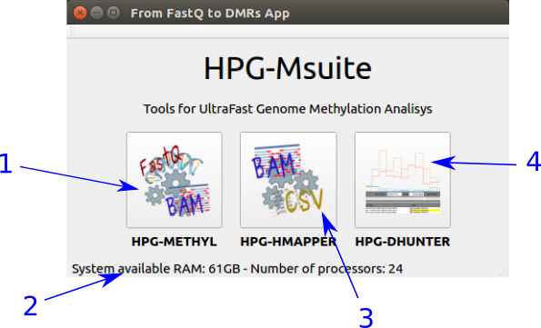
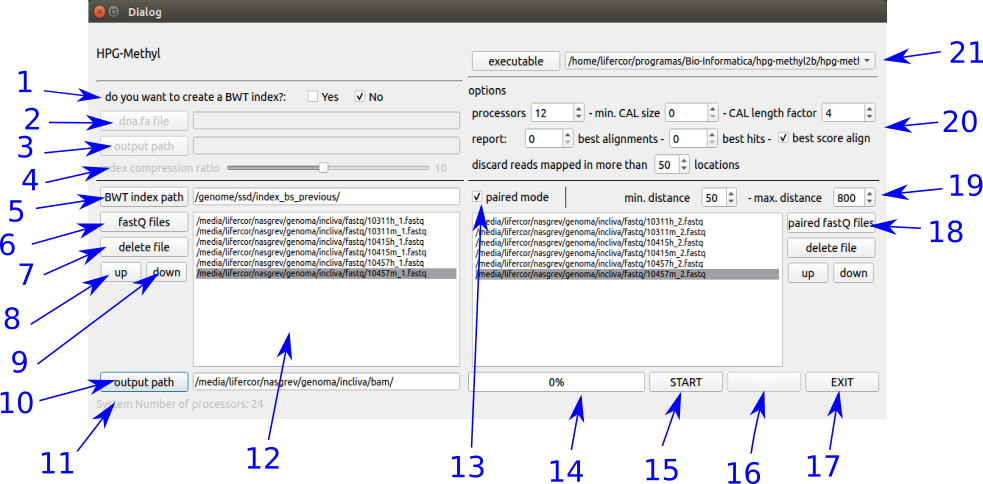
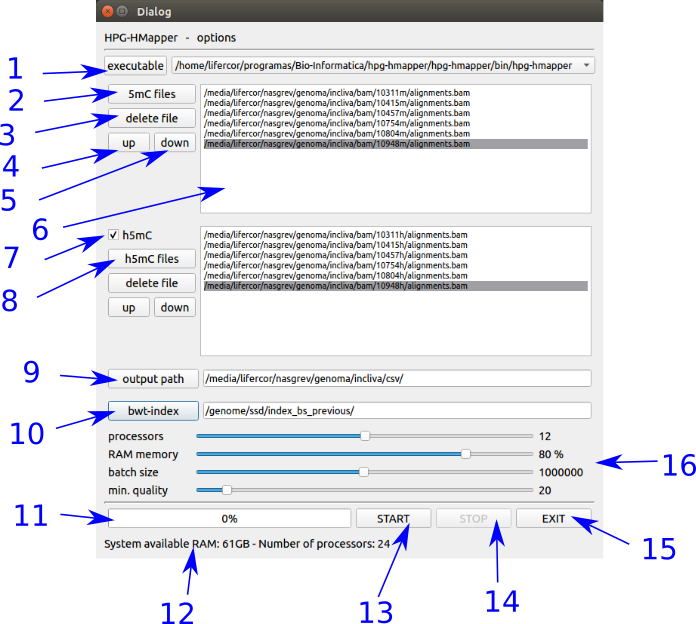

# HPG-Msuite
**HPG-Msuite** is a powerful and friendly tool kit for DNA methylation analysis. HPG-Msuite began with [**HPG-Methyl**](https://github.com/grev-uv/hpg-methyl), an ultrafast and highly sensitive Next-Generation Sequencing read mapper and methylation context extractor, that works with single-end or paired-end .fastq files and provides .bam files. The following income tool was [**HPG-Hmapper**](https://github.com/grev-uv/hpg-hmapper), a parallel software tool for analyzing DNA hydroximethylation data, it works with the .bam files from HPG-Methyl and it provides .csv files. This tool offer the mapping of the number of Cs, noCs, 5mCs and 5hmCs reads per position, chromosome and sense (forward, reverse).

The last income is [**HPG-Dhunter**](https://github.com/grev-uv/hpg-dhunter), a powerful real-time visualizer tool that uses the high performance parallel computation of GPUs and CUDA application programming interface model for analyze the DNA methylation and show the results, minimizing the CPU-GPU communication. HPG-Dhunter also has a version to identify the DMRs without visualization. This [version](https://github.com/grev-uv/hpg-dhunter-batch) works identifying DMRs using all the samples. This is possible thanks to it works with batches of samples, solving the GPU memory limitation. Finally it provides a .csv and .gff file.

## Handling
**HPG-Msuite** shows a user interface (UI) whose design has been developed according with usability good practices. HPG-Msuite offers a quick access to automate analysis processes from alignment fastq samples to display the DMRs.

This is the main UI:

where:
1. Launch HPG-Methyl interface.
2. System information
3. Launch HPG-Hmapper interface.
4. Launch HPG-Dhunter application.

Once the **HPG-Methyl** interface is running, the alignment process of fastq files can be done for all the samples easily. This interface turns the alignment process through the terminal, typing one by one the commands for each sample of the set, into an automated process.

This is the main UI:

where:
1. Burrows-Wheeler transform index is needed for alignment. Here it can be done
2. Select the path to chromosome reference .fa
3. Select the path to save de BWT index
4. Select the compression ratio
5. Select the path where the BWT is.
6. Select the fastq files to align.
7. Delete the file marked
8. Rise the line marked in the list (12)
9. Go down the line marked in the list (12)
10. Select the path to save the BAM aligned files.
11. System information.
12. List of the fastq selected to align.
13. Select if this is a process with paired files to align.
14. Progress bar.
15. Button to start the process.
16. Button to stop the process.
17. Button to exit from the interface and return to HPG-Suite interface.
18. Select the paired fastq files to align.
19. Some parameters of paired alignment process.
20. Some parameters of alignment process.
21. Select the HPG-Methyl executable file.

Once the **HPG-Hmapper** interface is running, the mapping process of bam files can be done for all the samples easily. This interface turns the alignment process through the terminal, typing one by one the commands for each sample of the set, into an automated process.

This is the main UI:

where:
1. Select the HPG-Hmapper executable file.
2. Select the 5mC bam files.
3. Delete the file marked.
4. Rise the file marked.
5. Go down the file marked.
6. List of 5mC bam files to map.
7. Select if there are 5hmC paired files.
8. Select the 5hmC bam files.
9. Select the path to save the csv mapped files
10. Selexct the path where the BWT index of the chromosome reference is.
11. Progress bar.
12. System information.
13. Button to start the process.
14. Button to stop the process.
15. Button to exit from the interface and return to HPG-Suite interface.
16. Some parameters of mapping process.

Once the **HPG-Dhunter** process is launched, the [README.md](https://github.com/grev-uv/hpg-dhunter) of the git repository can help to work with this tool.

For a properly use of **HPG-Msuite**, a previous installation of HPG-Methyl, HPG-Hmapper and HPG-Dhunter is needed in the same computer. Besides, in the line 77 of iface.cpp file, the path to the HPG-Dhunter executable file must be changed.

## System requirement
The **HPG-Msuite** is a useful interface for methylation analysis with HPG tool kit. Then, the system requirement needs to be, at least, the same for HPG-Methyl and HPG-Hmapper, adding a GPU device for HPG-Dhunter.
So HPG-Msuite should work properly in a station with the following set-up:
- A 64 bit Intel CPU compatible with SSE4.2.
- The DNA data for DMR tasks needs as adjacent memory as the number of samples by the length of the largest chromosome to be analized. This parameter has a direct relation with the global memory available of the GPU device. The test was done with 32 MB of RAM.
- The amount of samples that HPG-Dhunter can analize at the same time is directly dependent with the amount of the device memory. Working with a Nvidia GeForce GTX 1080 with 8 GB of GRAM, is possible to analyze and visualize up to six samples of chromosome-21 or up to four chromosome-10 or up to two chromosome-1 at the same time.
- The CUDA compilation is configured to a single device with Nvidia Pascal GPU architecture. So, the devices that will work properly are Titan XP and X models, Tesla P40, P6 and P4 models, Quadro P6000, P5000, P4000 models, GeForce GTX 1808Ti, 1080, 1070Ti, 1070 models, and others easy to find here.
- The Nvidia driver is needed (v384 or higher).
- The CUDA API is needed(v9 or higher).

## Build
The way to build HPG-Msuite in your system is opening the software as a project inside an installed QtCreator (> v4.5, Qt > v5.8, GCC 5) IDE and build it from there.

## Issues
**HPG-Msuite** - Copyright (C) 2019 - grev-uv
This program comes with ABSOLUTELY NO WARRANTY.
This is free software, and you are welcome to redistribute it under certain conditions; visit https://www.gnu.org/copyleft/gpl.html for details.
However, if you find any bugs, issues, want a specific feature added or need help, feel free to add an issue or extend an existing one. Pull requests are welcome.

## License
HPG-Msuite is free software and licensed under the GNU General Public License version 3.
HPG-Msuite was developed under Qt as a platform application development framework for linux/ubuntu desktop, using a free software LGPL v3 license.

## Contact
Contact any of the following developers for any enquiry:
- Juanma Orduña (juan.orduna@uv.es). 
- Mariano Pérez (mariano.perez@uv.es). 
- Lisardo Fernández (lisardo.fernandez@uv.es). 
